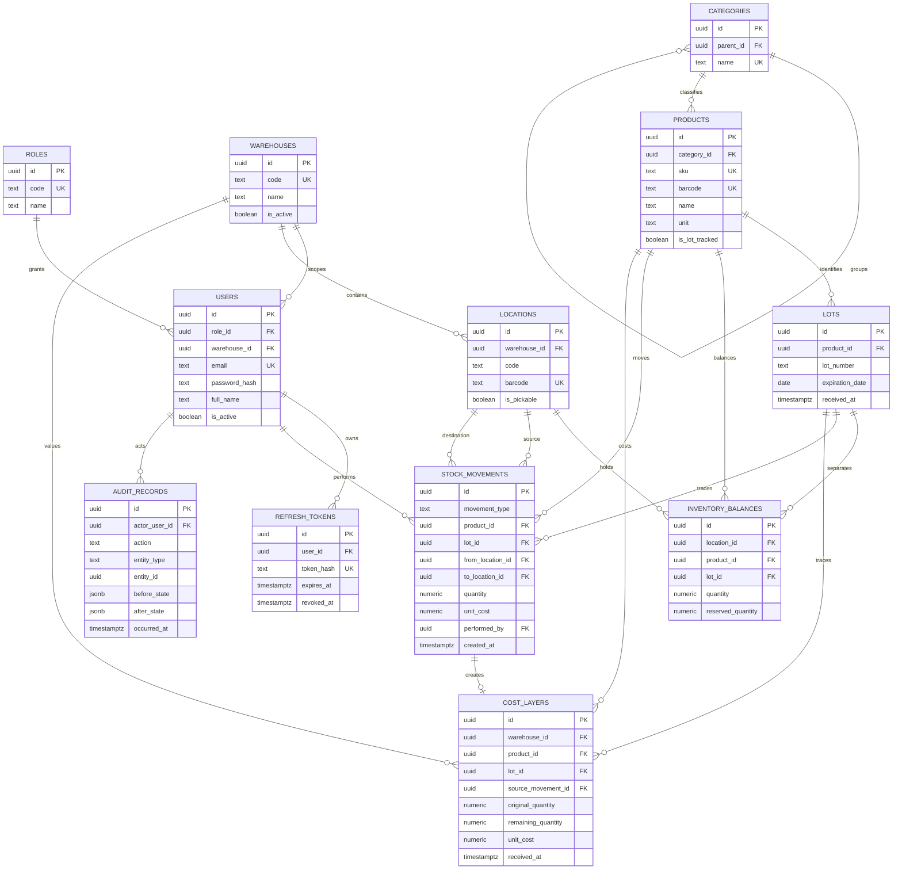

# BWIMS database design and ERD

This is the initial PostgreSQL 16 schema for GitHub Issue #2. It supports
multi-warehouse stock, product and location barcodes, lot and expiry tracking,
FEFO physical picking, FIFO valuation, immutable stock movements, and an
append-only audit trail.

## Entity relationship diagram



## Business rules represented in the schema

- Product and location barcodes are unique when present.
- A lot number is unique within a product; expiry is indexed with receipt time
  so a service can select stock using FEFO.
- Each location/product/lot combination has one inventory balance, including
  non-lot-tracked products where `lot_id` is null.
- Inventory and reservations cannot be negative, and reservations cannot exceed
  the physical balance.
- Receive, pick, transfer, and adjustment movements require valid source and
  destination shapes. Stock movement rows cannot be changed or deleted.
- FIFO valuation remains separate from FEFO selection. Open cost layers are
  indexed by warehouse, product, receipt time, and ID.
- Audit records capture before/after JSON and cannot be changed or deleted.
- Email uniqueness is case-insensitive.

## Transaction boundary

The application service must execute each receive, pick, transfer, or adjustment
inside one PostgreSQL transaction:

1. Lock the affected inventory balance and open cost-layer rows.
2. Validate stock, reservation, lot, and location rules.
3. Insert the immutable stock movement.
4. Update the source and/or destination inventory balances.
5. Create or consume FIFO cost layers when valuation changes.
6. Insert the immutable audit record.
7. Commit all changes together, or roll back all changes on any error.

The migration supplies constraints and indexes for these transactions; the Go
inventory module will implement the service operations in Weeks 9–10.

## Migration commands

```bash
docker compose up -d postgres
docker compose run --rm migrate
```

To roll back only this schema migration:

```bash
make migrate-down
```

The `pgcrypto` extension is intentionally retained during rollback because it
may be shared by later migrations.
