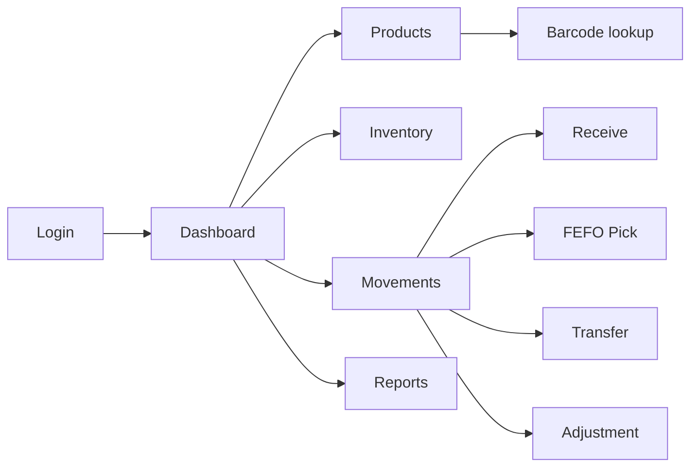

# BWIMS user journeys and responsive wireframes

## Navigation model



Role visibility:

- Admin: all navigation and user management.
- Warehouse manager: warehouse, product, movement and report operations.
- Picker: lookup, receive and pick workflows; no configuration deletion.
- Viewer: read-only dashboard, inventory and reports.

## Core journeys

### Login

1. User enters email and password.
2. UI validates required fields and email format.
3. API authenticates the bcrypt password and returns RS256 tokens plus user role.
4. UI loads role-appropriate navigation.
5. Invalid credentials show a generic error without revealing account existence.

### Dashboard

1. User sees warehouse context, stock summary, expiry alerts and recent movement.
2. Loading uses skeletons; API failures show retry; no data shows an empty state.
3. Cards and charts link to filtered inventory or movement screens.

### Product lookup

1. User scans or types a barcode.
2. Client validates a supported EAN/UPC checksum.
3. API looks up the product without changing inventory.
4. Known product shows identity and allowed actions; unknown product offers
   admin/manager creation or a picker-safe error.

### Receive

1. Scan/choose product and destination location.
2. Enter lot number, expiry, quantity and unit cost.
3. Review a confirmation summary.
4. API commits movement, balance, cost layer and audit together.
5. Success shows the new balance and reference number.

### FEFO pick

1. Scan/choose product and requested quantity.
2. API proposes non-expired lots by nearest expiry.
3. User confirms the suggested source and quantity.
4. API atomically consumes stock by FEFO and cost layers by FIFO.
5. Success shows picked lots and remaining quantity.

### Transfer

1. Select source and destination; they cannot be the same.
2. Choose product/lot and an available quantity.
3. Confirm both locations.
4. API atomically decreases source and increases destination.

### Adjustment

1. Manager selects product, location and lot.
2. Enter increase/decrease quantity and required reason.
3. Review the old and proposed balance.
4. Confirm to create an immutable adjustment and audit record.

## Desktop wireframes

### Login

```text
┌─────────────────────────────────────────────────────────────┐
│ BWIMS                                                       │
│                                                             │
│                  ┌──────────────────────┐                   │
│                  │ Welcome back         │                   │
│                  │ Email [___________]  │                   │
│                  │ Password [________]  │                   │
│                  │ [ Sign in ]          │                   │
│                  │ Error / loading      │                   │
│                  └──────────────────────┘                   │
└─────────────────────────────────────────────────────────────┘
```

### Application shell and dashboard

```text
┌───────────────┬─────────────────────────────────────────────┐
│ BWIMS         │ Warehouse selector       User / role        │
│ Dashboard     ├─────────────────────────────────────────────┤
│ Products      │ Inventory value │ Low stock │ Expiring      │
│ Inventory     ├─────────────────────────────────────────────┤
│ Movements     │ Expiry trend / recent movements             │
│ Reports       │                                             │
│               │ [Loading | Empty | Error | Populated]       │
└───────────────┴─────────────────────────────────────────────┘
```

### Product list and form

```text
┌───────────────┬─────────────────────────────────────────────┐
│ Navigation    │ Products                  [Scan] [Add]       │
│               │ Search [____] Category [v]                  │
│               │ SKU │ Barcode │ Name │ Category │ Status    │
│               │ ... paginated / empty / loading ...         │
│               │                                             │
│               │ Form drawer: identity, barcode, unit, lot   │
│               │ [Cancel] [Save] validation / success        │
└───────────────┴─────────────────────────────────────────────┘
```

## Hardware scanner and confirmation wireframes

```text
┌──────────────────────┐
│ ← Barcode test       │
│ Hardware scanner     │
│ [__________________] │
│ Scan sends Enter     │
│ Result: 8851234567890 │
│ ✓ Valid EAN-13       │
│ [Use value] [Clear]  │
│ Camera scan (optional)│
└──────────────────────┘

┌──────────────────────┐
│ Confirm receive      │
│ Product: Cola 330 ml │
│ Lot: LOT-2026-07     │
│ Expiry: 2027-01-01   │
│ Location: A-01-02    │
│ Quantity: 24 cases   │
│                      │
│ [Cancel] [Confirm]   │
└──────────────────────┘
```

## State and accessibility requirements

- Every asynchronous screen has loading, empty, error and success states.
- Validation is shown next to the field and summarized for screen readers.
- All actions are keyboard reachable with visible focus.
- Text and interactive controls meet WCAG AA contrast targets.
- Touch controls are at least 44 × 44 CSS pixels.
- Color is never the only indicator of status.
- Scanner screens use USB/Bluetooth hardware input by default, provide manual
  entry as fallback and offer phone-camera scanning only as an optional method.
- Destructive or stock-changing operations require explicit confirmation.
